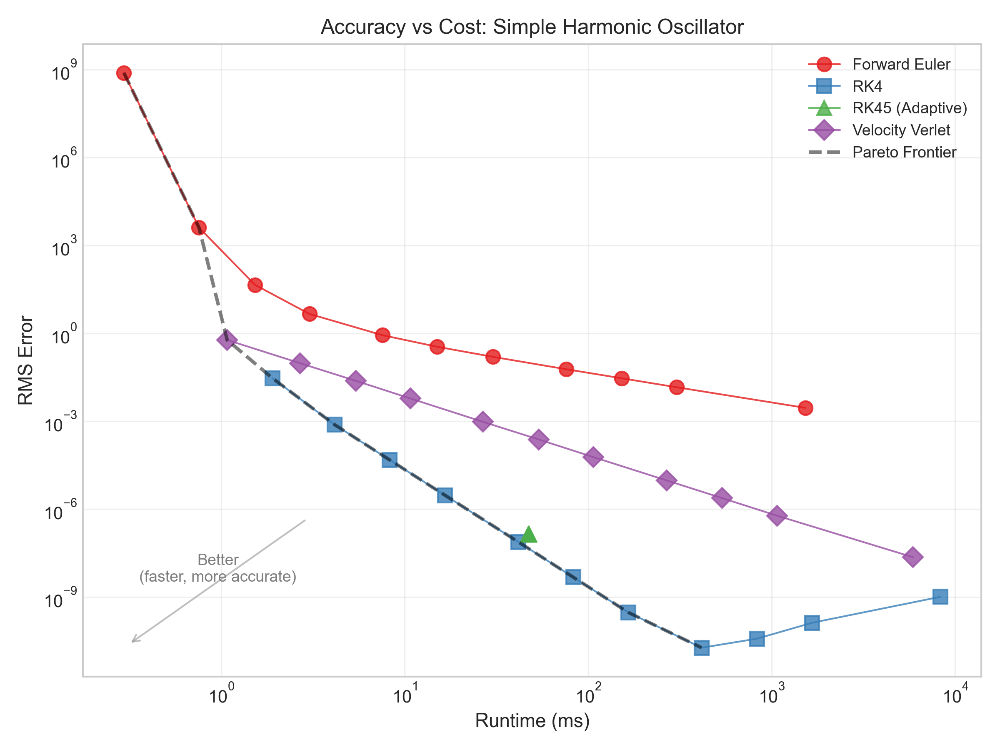
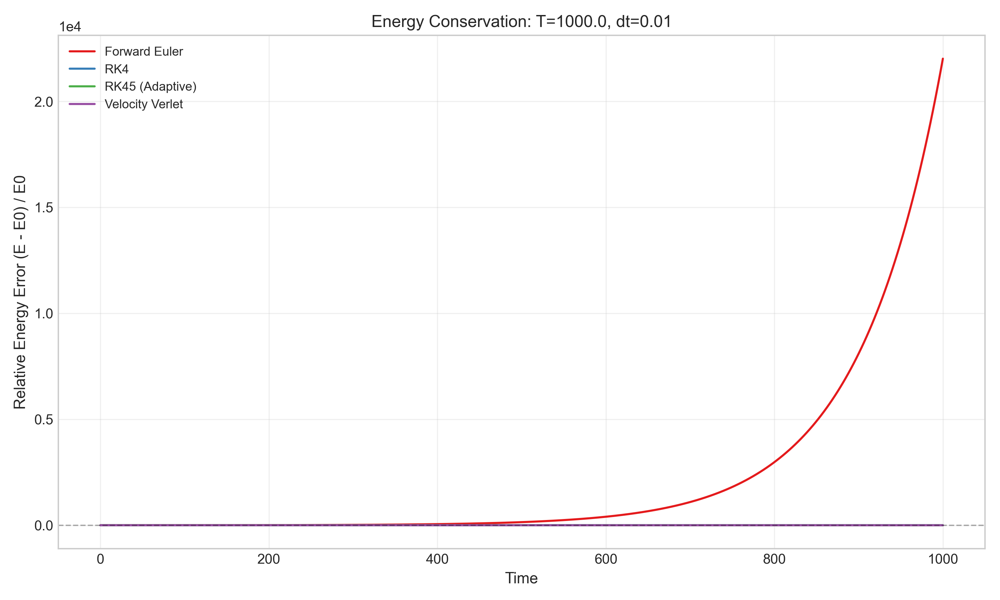

# Numerical Integration Benchmarks for Physics Simulations

A systematic study of numerical integration methods, analyzing **accuracy vs compute cost tradeoffs** for physics simulations.

## Research Question

**How do numerical integration methods trade accuracy vs compute cost for physics simulations?**

This project implements and benchmarks four numerical integrators on physics problems, measuring:
- Accuracy (error vs analytical/reference solutions)
- Computational cost (runtime, function evaluations)
- Stability (maximum stable timestep)
- Energy conservation (critical for long-time physics)

## Key Findings

### Order of Accuracy (Error ~ O(dt^n))

| Method | Order | Best Use Case |
|--------|-------|---------------|
| Forward Euler | 1 | Baseline, education |
| Velocity Verlet | 2 | Long-time physics, energy conservation |
| RK4 | 4 | General purpose, good accuracy/cost ratio |
| RK45 (Adaptive) | 4-5 | When accuracy target is known |

### The Accuracy-Cost Tradeoff



**Key insight**: The "best" integrator depends on what you're optimizing for:
- **High accuracy requirements**: RK45 (adaptive) dominates
- **Moderate accuracy, fixed timestep**: RK4 is optimal
- **Long-time physics simulations**: Velocity Verlet (symplectic) preserves energy
- **Euler is never optimal** - included only as baseline

### Energy Conservation



Symplectic integrators (Verlet) maintain bounded energy drift over long times, while non-symplectic methods (RK4) accumulate energy errors. This is critical for molecular dynamics, celestial mechanics, and any simulation where physical conservation laws matter.

## Installation

```bash
# Clone the repository
git clone https://github.com/yourusername/compute-physics-benchmarks.git
cd compute-physics-benchmarks

# Install dependencies
pip install -r requirements.txt

# Optional: GPU support (requires CUDA)
pip install cupy-cuda12x
```

## Usage

### Run All Experiments

```bash
python run_all.py
```

### Run Individual Experiments

```bash
# Accuracy vs timestep sweep
python experiments/run_accuracy_sweep.py

# Stability analysis
python experiments/run_stability_analysis.py

# Long-term energy conservation
python experiments/run_longterm.py

# GPU scaling (requires CuPy)
python experiments/run_gpu_scaling.py
```

### Generate Plots

```bash
python -c "from src.plotting.figures import generate_all_figures; generate_all_figures()"
```

### Quick Test

```bash
python test_basic.py
```

## Project Structure

```
compute-physics-benchmarks/
├── src/
│   ├── integrators/          # Numerical integration methods
│   │   ├── euler.py          # Forward Euler (1st order)
│   │   ├── rk4.py            # Runge-Kutta 4 (4th order)
│   │   ├── rk45.py           # Adaptive RK45
│   │   └── verlet.py         # Velocity Verlet (symplectic)
│   ├── problems/             # Physics test problems
│   │   ├── harmonic.py       # Simple harmonic oscillator
│   │   └── pendulum.py       # Nonlinear pendulum
│   ├── benchmarks/           # Benchmarking infrastructure
│   │   ├── accuracy.py       # Error metrics
│   │   ├── timing.py         # Runtime measurement
│   │   └── runner.py         # Benchmark orchestration
│   ├── gpu/                  # GPU acceleration (CuPy)
│   └── plotting/             # Publication-quality figures
├── experiments/              # Experiment scripts
├── results/
│   ├── data/                 # Raw benchmark data (CSV, JSON)
│   └── figures/              # Generated plots
├── writeup/                  # Technical report
├── requirements.txt
├── run_all.py               # Master script
└── test_basic.py            # Quick validation
```

## Integrators Implemented

### Forward Euler (1st order)
```
y_{n+1} = y_n + dt * f(t_n, y_n)
```
- Simplest possible integrator
- 1 function evaluation per step
- Not stable for large timesteps

### Runge-Kutta 4 (4th order)
```
k1 = f(t, y)
k2 = f(t + dt/2, y + dt*k1/2)
k3 = f(t + dt/2, y + dt*k2/2)
k4 = f(t + dt, y + dt*k3)
y_{n+1} = y_n + (dt/6)(k1 + 2k2 + 2k3 + k4)
```
- Industry standard for non-adaptive integration
- 4 function evaluations per step
- Good accuracy/cost ratio

### RK45 Adaptive (4th/5th order)
- Runge-Kutta-Fehlberg embedded pair
- Automatic step size control
- Maintains specified error tolerance
- 6 function evaluations per step (but fewer steps needed)

### Velocity Verlet (2nd order, symplectic)
```
x_{n+1} = x_n + v_n*dt + 0.5*a_n*dt^2
v_{n+1} = v_n + 0.5*(a_n + a_{n+1})*dt
```
- Symplectic: preserves phase space volume
- Bounded energy error (doesn't grow over time)
- Essential for molecular dynamics and celestial mechanics

## Test Problems

### Simple Harmonic Oscillator
```
d²x/dt² = -ω²x
```
- Analytical solution: x(t) = A·cos(ωt + φ)
- Tests basic accuracy and energy conservation
- Ground truth for error measurement

### Nonlinear Pendulum (Large Angle)
```
d²θ/dt² = -(g/L)·sin(θ)
```
- No closed-form solution
- Tests integrator on realistic nonlinear physics
- Uses high-accuracy reference solution

## Results

All benchmark data is saved in `results/data/` as CSV and JSON files.

Generated figures in `results/figures/`:
- `error_vs_timestep_*.png` - Accuracy vs timestep (shows order)
- `runtime_vs_timestep_*.png` - Computational cost
- `pareto_*.png` - Accuracy-cost tradeoff
- `energy_drift.png` - Long-term energy conservation
- `stability_regions.png` - Maximum stable timesteps
- `phase_portrait.png` - Qualitative behavior comparison

## Technical Notes

### Why Include Velocity Verlet?

Despite being only 2nd order accurate, Velocity Verlet is often preferred for physics simulations because it's **symplectic**. This means:

1. **Bounded energy error**: Energy errors oscillate but don't grow
2. **Phase space preservation**: The integrator preserves the geometric structure of Hamiltonian systems
3. **Time reversibility**: Running backward recovers the initial state

For simulations running millions of timesteps (molecular dynamics, planetary orbits), this property is more important than instantaneous accuracy.

### Adaptive vs Fixed Timestep

RK45 adapts its timestep to maintain a specified error tolerance. This is efficient when:
- The solution has varying complexity (smooth regions vs sharp changes)
- You have a target accuracy in mind
- You don't need equally-spaced output points

Fixed timestep (RK4, Verlet) is preferred when:
- Output at regular intervals is needed
- Overhead of step adaptation is significant
- Energy conservation is critical (adaptive methods aren't symplectic)

## Dependencies

- NumPy >= 1.24.0
- Matplotlib >= 3.7.0
- SciPy >= 1.10.0
- Pandas >= 2.0.0
- CuPy >= 12.0.0 (optional, for GPU acceleration)

## Author

Batyr - Physics BS, Arizona State University

## License

MIT License - See LICENSE file for details.

---

*This project demonstrates systematic benchmarking methodology for computational physics research.*
